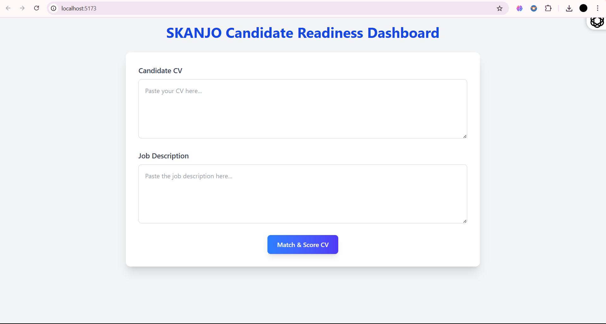
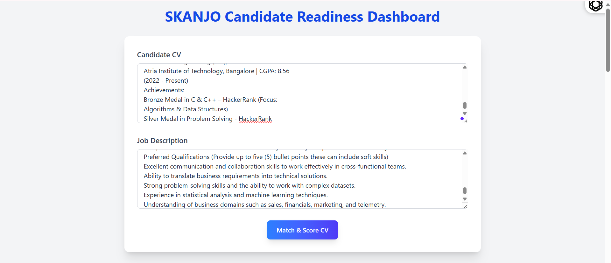
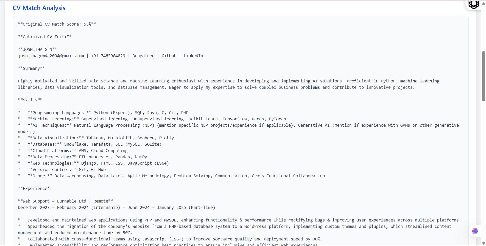
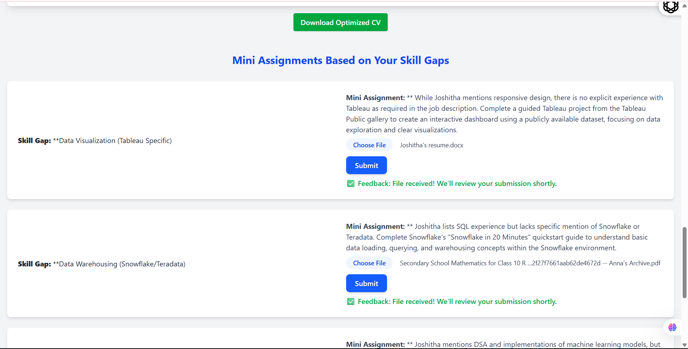

# Candidate Readiness Dashboard

A React-based web application that analyzes a candidate’s resume against a job description to provide a match score, highlight skill gaps, and suggest mini-assignments with feedback for self-improvement.

---

## 🚀 Live Demo

👉 [Click Here to View the Live App](https://cv-readiness-dashboard-git-main-jooshithas-projects.vercel.app/)  


---

## 🛠️ Local Setup Instructions

To run this project locally, follow these steps:

### 1. Clone the Repository

```bash
git clone hhttps://github.com/Jooshitha/CV-Readiness-Dashboard.git
cd candidate-readiness-dashboard
```

### 2. Install Dependencies

```bash
npm install
```

### 3. Start the Development Server

```bash
npm run dev
```

### 4. Open in Browser

Go to:  
[http://localhost:5173](http://localhost:5173)

---

## 📘 Usage Instructions

1. Upload your **Resume (PDF)** and **Job Description (PDF)**.
2. Click **Match & Score CV**.
3. View:
   - ✅ CV Match Score
   - ✅ Matched and Missing Skills
   - ✅ Optimized CV with download option
   - ✅ Skill Gap Analysis
   - ✅ AI-generated Mini Assignments
   - ✅ Simulate Submission and see Feedback

---

## 🧠 Technical Decisions & Challenges

### ✅ Key Technical Choices

- **React + Vite**: For fast development and modular structure.
- **TailwindCSS**: For responsive and utility-first design.
- **Component Breakdown**:
  - `ResumeUpload`: Handles file input and state.
  - `MatchScoreDisplay`: Shows score, match %, and visualizations.
  - `SkillGaps`: Lists AI-detected gaps.
  - `MiniAssignments`: Shows learning tasks with "Simulate Submission" and mock feedback.
- **OpenAI Integration**: Used for intelligent analysis of CV and JD.
- **State Management**: React hooks used for dynamic rendering.

### ⚠️ Challenges Faced

- **AI Response Formatting**: Cleanly extracting structured info from natural language responses.
- **Keeping Assignments Separate**: Ensuring UI separation between gap analysis and tasks.
- **Feedback Simulation**: Managing per-assignment submission + feedback cycle.

---

## 📸 Screenshots (Optional)








```

---

